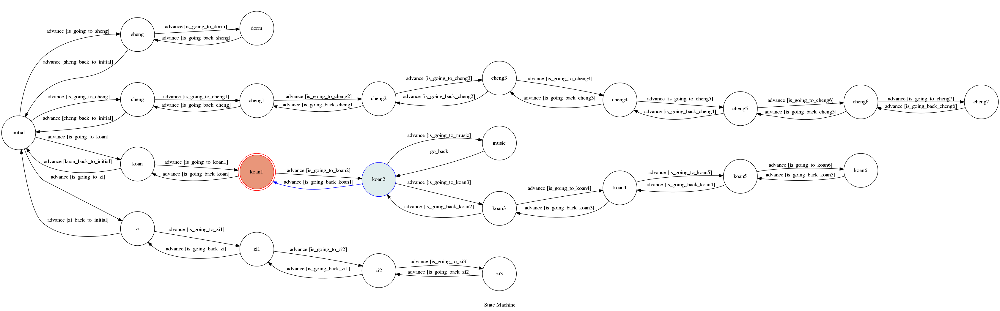

# TOC Project 2017

A telegram bot based on a finite state machine

主題：成功大學校園導覽


## Secret Data

`API_TOKEN` and `WEBHOOK_URL` in app.py **MUST** be set to proper values.
Otherwise, you might not be able to run the code.

### Run Locally
You can either setup https server or using `ngrok` as a proxy.

**`ngrok` would be used in the following instruction**

```sh
ngrok http 5000
```

After that, `ngrok` would generate a https URL.

You should set `WEBHOOK_URL` (in app.py) to `your-https-URL/hook`.

#### Run the sever

```sh
python3 bot.py
```

## Finite State Machine


## How to interact with the bot

起點位於成功校區門口與勝利校區門口中間，以成功校區方向為上方，輸入`上`，`下`，`左`，`右`，可以移動至校區內的各個地點

每到一個點，Bot會回傳附近的圖片及相關地點的連結。

示意圖如下：


